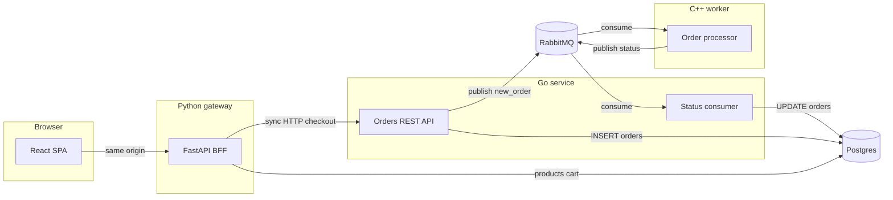

# Async microservices: Compose, Python+React FE, Go API, C++ worker

## Architecture (high level)

**Sync path (1→2):** Browser talks only to the Python app (same origin). Python serves the React build and implements catalog/cart using a signed **session cookie** (e.g. Starlette `SessionMiddleware` with server secret). Checkout is a server-side call from FastAPI to the Go service (no CORS on the browser for Go).

**Async path (2→3):** Go creates a row in Postgres, publishes an **order event** to RabbitMQ. The C++ service consumes, simulates fulfillment/shipping steps, and publishes **status updates** to another queue/exchange.

**Feedback (3→2):** Go runs a **background consumer** (same process or separate goroutine) that applies status updates to Postgres. The React app can poll FastAPI `GET /api/orders/:id` which proxies Go `GET /orders/:id` so the UI stays on one origin.

---

## 1. `docker-compose.yml` and infrastructure

Single Compose file at repo root, e.g. [`docker-compose.yml`](/Users/eglaw/Projects/Learning/python/learning-comunications/async-rabbitmq/docker-compose.yml):

- **postgres**: official image, volume for data, `POSTGRES_USER/PASSWORD/DB`, mount [`postgres/init.sql`](/Users/eglaw/Projects/Learning/python/learning-comunications/async-rabbitmq/postgres/init.sql) for schema bootstrap.
- **rabbitmq**: official image with management port (optional `15672`) for debugging; env for default user/pass.
- **go-orders**: build from [`services/orders-api/Dockerfile`](/Users/eglaw/Projects/Learning/python/learning-comunications/async-rabbitmq/services/orders-api/Dockerfile); depends on `postgres`, `rabbitmq`; expose `8080` (internal to compose network; not required on host if only Python calls it—still useful for debugging).
- **cpp-worker**: build from [`services/order-worker/Dockerfile`](/Users/eglaw/Projects/Learning/python/learning-comunications/async-rabbitmq/services/order-worker/Dockerfile); depends on `rabbitmq` (and optionally `postgres` only if you later add direct DB access—initial design can keep DB writes only in Go).
- **web** (Python + React): multi-stage or two-step image—build React (`npm ci && npm run build`), copy `dist` into Python image; FastAPI serves static files and `/api/*`; depends on `postgres`, `go-orders`, `rabbitmq` not required for gateway.

Shared **Docker network** default bridge is fine; service DNS names (`go-orders`, `postgres`, etc.) for connection strings.

---

## 2. Postgres schema (minimal, learning-friendly)

In [`postgres/init.sql`](/Users/eglaw/Projects/Learning/python/learning-comunications/async-rabbitmq/postgres/init.sql):

- **`products`**: `id`, `name`, `price_cents`, `stock` (seed a few rows).
- **`cart_items`**: `session_id` (string from cookie/session), `product_id`, `qty`, unique `(session_id, product_id)`.
- **`orders`**: `id` (UUID), `session_id`, `status` (`pending` → `processing` → `shipped` / `failed`), `payload` (JSONB for line items snapshot), `created_at`, `updated_at`.

Ownership: Python reads/writes `products` + `cart_items`; Go reads/writes `orders` (and on checkout, Python can pass line items in the request body so Go does not need to read `cart_items`—simplest boundary).

---

## 3. RabbitMQ topology

Keep it explicit and easy to trace:

- **Exchange** `orders.events` (type `topic`).
- **Queue** `orders.new` bound with routing key `order.new` — Go publishes after insert; C++ consumes.
- **Queue** `orders.status` bound with routing key `order.status` — C++ publishes; Go consumer applies updates.

**Payloads** (JSON): e.g. `{"order_id":"...","session_id":"...","items":[...]}` for new orders; `{"order_id":"...","status":"processing|shipped|failed","detail":"..."}` for feedback.

Declare the same topology in **both** Go and C++ on startup (declare exchange, queues, bindings) so Compose does not require a separate `definitions.json` (optional enhancement later).

---

## 4. Python + React frontend ([`services/web/`](/Users/eglaw/Projects/Learning/python/learning-comunications/async-rabbitmq/services/web/))

- **React** (Vite + TypeScript): pages for product list, cart, checkout; `fetch('/api/...')` only.
- **FastAPI**:
  - Session middleware (cookie-based anonymous `session_id`).
  - `GET /api/products`, `GET/POST /api/cart`, `POST /api/cart/items`, etc.
  - `POST /api/checkout`: read cart from DB, `httpx.post` to Go `http://go-orders:8080/orders` with JSON body + `session_id`, clear cart on success, return `{ order_id }`.
  - `GET /api/orders/{id}`: proxy to Go for status polling.

Static: mount React build at `/` and reserve `/api` for API (standard pattern).

---

## 5. Go REST API ([`services/orders-api/`](/Users/eglaw/Projects/Learning/python/learning-comunications/async-rabbitmq/services/orders-api/))

- **`POST /orders`**: validate body, insert `orders` with `pending`, publish to RabbitMQ `order.new`, return `201` + `id`.
- **`GET /orders/{id}`**: return order row (for UI polling).
- **Goroutine or separate `Consume`**: subscribe to `orders.status`, `UPDATE orders SET status=... WHERE id=...`.
- Libraries: `database/sql` + `pgx` or `lib/pq`, `amqp091-go` for RabbitMQ.

Config via env: `DATABASE_URL`, `AMQP_URL`.

---

## 6. C++ order worker ([`services/order-worker/`](/Users/eglaw/Projects/Learning/python/learning-comunications/async-rabbitmq/services/order-worker/))

- **CMake** project linking **`rabbitmq-c`** (librabbitmq) for AMQP 0-9-1.
- Loop: consume `orders.new`, parse JSON (e.g. **nlohmann/json** via FetchContent or submodule—keep vendoring simple for a learning repo).
- Simulate work: sleep + publish `processing`, then `shipped` (or `failed` occasionally) to `order.status`.
- Dockerfile: multi-stage `cmake --build` → slim runtime image with compiled binary.

---

## 7. Configuration and secrets

- Compose `environment` blocks: DB URLs, RabbitMQ URL, `SESSION_SECRET` for Python, consistent credentials across services.
- No real payment or PII; session is anonymous cart identity only.

---

## 8. Implementation order (recommended)

1. Add `postgres/init.sql` + empty tables + seeds.
2. Scaffold Go service: DB insert + HTTP `POST/GET` + Rabbit publish; then add consumer for status.
3. Scaffold C++ worker: consume + publish (verify end-to-end with `docker compose up`).
4. Scaffold FastAPI + React: products/cart/checkout proxy; wire Compose.
5. Polish: basic error handling, README with `docker compose up --build` only (optional—only if you ask for docs later).

---

## 9. Scope boundaries (kept minimal)

- No JWT/OAuth; session cookie only for storefront identity.
- No Kubernetes; single-host Compose.
- Status to UI via **polling** (simplest); SSE/WebSocket can be a follow-up.
