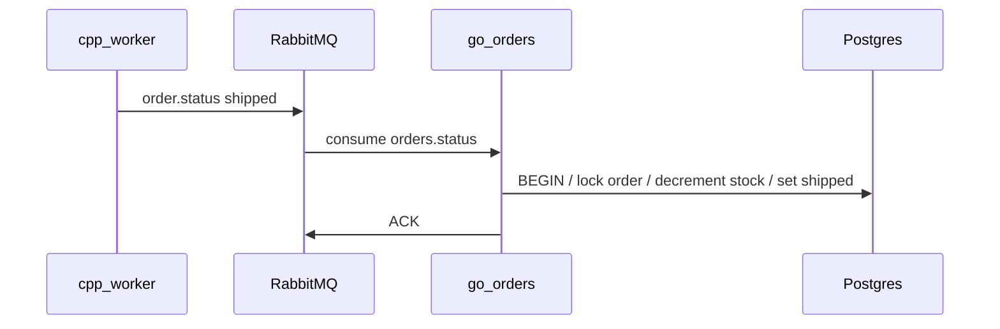

# Decrement stock when order status is `shipped`

## Context

- New orders are inserted with `payload` = `{"items":[...]}` where each item has `product_id`, `qty`, etc. ([`handleCreateOrder`](services/orders-api/main.go) lines 194–210).
- The status consumer [`applyStatusUpdate`](services/orders-api/main.go) currently only runs `UPDATE orders SET status = $2 ...` (lines 73–76) for `processing`, `shipped`, and `failed`.
- [`consumeStatusLoop`](services/orders-api/rabbit.go) **nack+requeues** on `applyStatusUpdate` errors, so stock logic must be safe under retries and must not double-decrement if `shipped` is applied twice.

## Recommended behavior

1. **`processing` and `failed`**  
   Keep the existing single `UPDATE orders SET status ...` (no inventory change).

2. **`shipped`**  
   Run everything in **one database transaction**:
   - `SELECT id, status, payload FROM orders WHERE id = $1::uuid FOR UPDATE`.
   - If no row: return error (unchanged semantics: unknown order).
   - If `status` is already **`shipped`**: **commit no-op and return `nil`** so duplicate `shipped` deliveries ACK cleanly (idempotency).
   - Parse `payload` into items (reuse the existing [`orderItem`](services/orders-api/main.go) shape; JSON key `items`).
   - For each line item, `UPDATE products SET stock = stock - $qty WHERE id = $product_id AND stock >= $qty`.
   - Verify each update affected exactly one row; if any item fails (missing product or insufficient stock), **rollback** and return an error (message will be nack+requeued per current consumer behavior—acceptable for a playground; optionally log loudly).
   - `UPDATE orders SET status = 'shipped', updated_at = NOW() WHERE id = $1::uuid`.
   - Commit.

3. **Implementation detail**  
   Use `pgxpool.Pool.Begin` (or `BeginTx` with the same timeout context pattern as today) inside `applyStatusUpdate` only for the `shipped` branch; keep the non-shipped path as a simple `Exec` or also run through a short transaction for consistency—either is fine.

## Files to change

- [`services/orders-api/main.go`](services/orders-api/main.go): extend `applyStatusUpdate` (and a small private helper if it keeps the function readable) to implement the transactional `shipped` path and idempotent “already shipped” handling.

## Out of scope (unless you want them later)

- **Reserving stock at checkout** (would require BFF or orders API changes and different failure modes).
- **Dead-letter / mark-order-failed** when stock decrement fails (would avoid infinite requeue).
- **DB migration** (not required: `products.stock` and `orders.payload` already exist per [`postgres/init.sql`](postgres/init.sql)).

## Manual verification

- `docker compose up`, place an order via the UI, wait for worker → confirm `products.stock` decreases by ordered quantities when order becomes `shipped`.
- Trigger duplicate `shipped` (e.g. republish same message in RabbitMQ UI) → stock should **not** drop twice.
