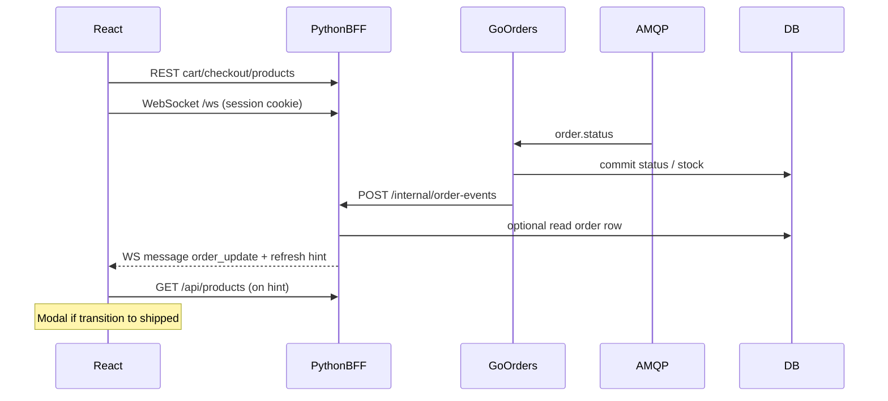

# WebSocket updates, Go→Python notify, shipped popup

## Current state (baseline)

- **React** polls `GET /api/orders/:id` every 1.5s while an order is active ([`services/web/frontend/src/App.tsx`](services/web/frontend/src/App.tsx)).
- **FastAPI BFF** proxies orders to Go; products/cart use Postgres ([`services/web/app/main.py`](services/web/app/main.py)).
- **Go** consumes `orders.status` from RabbitMQ and updates Postgres (`processing`/`shipped`/`failed`), including stock decrement on `shipped` ([`services/orders-api/main.go`](services/orders-api/main.go), [`services/orders-api/rabbit.go`](services/orders-api/rabbit.go)).
- **Postgres `orders`** includes `session_id` and JSON `payload` with line items—same DB the BFF uses, so Python can assemble full order JSON without calling Go after notify.

Your choices (**hybrid** REST + WS, popup **only on shipped**) drive the design below.

## Architecture

## 1. Python: WebSocket hub + internal notify endpoint

**WebSocket** (e.g. `GET /ws` — avoid colliding with `/api/*` unless you prefer `/api/ws`):

- Use Starlette/FastAPI `WebSocket`; ensure the browser sends the session cookie (same-origin + Vite proxy below) so [`SessionMiddleware`](services/web/app/main.py) can resolve `session_id` the same way as REST.
- Maintain an in-memory **session → set of WebSocket connections** (small demo-scale; document that multi-worker would need Redis or sticky sessions).

**Outbound messages** (JSON), for example:

- `{"type":"order_update","order":{...}}` — shape aligned with [`orderRow`](services/orders-api/main.go) (`id`, `session_id`, `status`, `payload`, `created_at`, `updated_at`) so the panel and modal reuse one type.
- `{"type":"catalog_changed"}` — cheap signal so the client refetches **`GET /api/products`** once (stock changed on shipped).

**Inbound messages** (optional minimal): heartbeat or unused for v1—the server pushes only based on backend events.

**Internal HTTP** `POST /internal/order-events`:

- **Not** routed through the SPA; callable only from the Docker network.
- Body: `{"order_id":"<uuid>"}` (and optionally mirroring `status` for logging).
- Auth: shared secret header (e.g. `X-Internal-Token`) matching env `INTERNAL_EVENTS_SECRET` on both Go and Python; reject mismatches with 401.
- Handler: validate token → load order from Postgres (`SELECT ... FROM orders WHERE id = $1`) → serialize like Go’s `handleGetOrder` → push `order_update` to all sockets for that **`session_id`** → if **`status === 'shipped'`**, append or combine with **`catalog_changed`** (or always send `catalog_changed` when status shipped to keep logic simple).

**Remove** the order-polling `useEffect` from the React side once WS is reliable; keep REST for initial checkout response (`order_id`).

## 2. Go: notify Python after successful status apply

In [`services/orders-api/rabbit.go`](services/orders-api/rabbit.go)’s `consumeStatusLoop`, **after** `applyStatusUpdate` succeeds and **before** `Ack` (or immediately after Ack—either is fine as long as DB is committed), fire a **non-blocking** HTTP notify:

- Env vars: `BFF_NOTIFY_URL` (e.g. `http://web:8000/internal/order-events`), `INTERNAL_EVENTS_SECRET`.
- If `BFF_NOTIFY_URL` is empty, skip (local tests without BFF).
- `POST` JSON `{"order_id":"<from message>"}` with the shared header; **2–3s timeout**; log failures, **do not** fail the AMQP consumer or prevent `Ack`.
- Implement with `net/http` in a small helper (new file or bottom of `main.go`).

**Note:** On idempotent `shipped` (already shipped, no DB change), Go still returns success; a duplicate notify is rare. The React modal should only open when **`previousStatus !== 'shipped'`** and **`newStatus === 'shipped'`** to avoid duplicate popups.

## 3. React: WebSocket client, panel, modal

[`services/web/frontend/src/App.tsx`](services/web/frontend/src/App.tsx) (and CSS if needed):

- Build WS URL from `window.location` (`ws:` / `wss:` + host + `/ws`).
- `useEffect`: open socket, `JSON.parse` messages; on `order_update`, if `order.id === activeOrderId`, update `orderStatus`; apply **shipped transition** rule for opening a **modal**.
- On `catalog_changed`, call existing `loadProducts()`.
- **Modal**: overlay + dialog with order id, status, timestamps, and line items from `order.payload.items` (names, qty, prices)—match fields from Go’s [`orderItem`](services/orders-api/main.go)).
- Replace the polling `useEffect` for orders with WS-driven updates; optionally one initial `fetch /api/orders/:id` after checkout before first WS message (covers race where `processing` applied before WS connects).

**Vite dev proxy:** extend [`services/web/frontend/vite.config.ts`](services/web/frontend/vite.config.ts) so `/ws` proxies to `http://127.0.0.1:8000` with `ws: true` (in addition to existing `/api`).

## 4. Docker / env

- [`docker-compose.yml`](docker-compose.yml): on **`go-orders`**, add `BFF_NOTIFY_URL=http://web:8000/internal/order-events` and `INTERNAL_EVENTS_SECRET` (same value as **`web`**).
- On **`web`**, add `INTERNAL_EVENTS_SECRET`.

No new public ports; internal URL uses the compose service name `web`.

## 5. Testing checklist (manual)

- `docker compose up`, place order → panel shows status via WS (`processing` then `shipped`) without polling.
- On `shipped`, products list stock drops after `catalog_changed` refetch.
- Shipped modal shows line items; closing modal does not break WS.
- Wrong/missing internal token → 401, Go still acknowledges AMQP.

## Files to touch (expected)

| Area | Files |
|------|--------|
| Python BFF | [`services/web/app/main.py`](services/web/app/main.py) (WS + internal route + connection manager); possibly split `ws.py` if `main.py` grows |
| Go | [`services/orders-api/rabbit.go`](services/orders-api/rabbit.go) (hook notify), new helper or `notify.go`, [`docker-compose.yml`](docker-compose.yml) |
| React | [`services/web/frontend/src/App.tsx`](services/web/frontend/src/App.tsx), [`services/web/frontend/vite.config.ts`](services/web/frontend/vite.config.ts), optional CSS |
| Docs | Optional: one line in [`README.md`](README.md) for new env vars (only if you want; you did not ask for doc-only edits—skip if keeping diff minimal) |

No new Python dependencies required: FastAPI/Starlette already support WebSockets via `uvicorn[standard]`.
