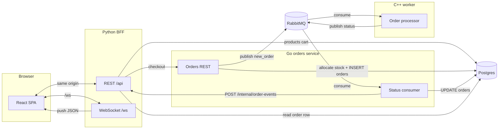

# Async e-commerce playground

A small demo store that exercises **async messaging** between services: a **FastAPI** backend-for-frontend (with a **React** storefront), a **Go** orders API, **PostgreSQL**, **RabbitMQ**, and a **C++** worker that consumes order jobs and reports status updates.

The browser uses **REST** for products, cart, and checkout, and a **WebSocket** (`/ws`) on the same BFF for **server-pushed updates**. After the Go service applies a RabbitMQ-driven status change in Postgres, it **POSTs** to an internal Python endpoint; the BFF loads the order row and broadcasts `order_update`, plus **`catalog_changed`** when that order **`shipped`**. Successful **checkout** also triggers **`catalog_changed`** from the BFF so every client refreshes stock early (details under **Inventory** below).

**Inventory:** `POST /orders` (called from **`POST /api/checkout`**) runs in a single Postgres transaction: line items are applied in **`product_id` order** (`UPDATE … SET stock = stock - qty WHERE stock >= qty`). If any line cannot be fulfilled, the transaction rolls back and the API responds with **409 Conflict** and a JSON body such as `{ "error": "insufficient_stock", "product_id": <id> }`. The BFF forwards **409** and **does not** clear the cart. Stock is **not** decremented again when the order reaches **`shipped`** (that transition only updates the order row). If an order moves to **`failed`** before **`shipped`**, stock from the payload is **restored** once (idempotent if already **`failed`**). After a successful checkout, the BFF also broadcasts **`catalog_changed`** so all sessions refetch products immediately, not only when an order ships.

## Architecture

**High-level data flow** (REST, AMQP, DB, and the notify path that fans out over WebSockets):



**Order status notify** (why the UI can drop polling for live status):

```mermaid
sequenceDiagram
  participant React
  participant PythonBFF as Python BFF
  participant GoOrders as Go orders
  participant AMQP as RabbitMQ
  participant DB as Postgres

  React->>PythonBFF: REST cart / checkout / products
  React->>PythonBFF: WebSocket /ws (session)
  Note over PythonBFF,GoOrders: Checkout: allocate stock in Go tx; optional 409 / cart kept
  Note over PythonBFF: On success checkout: WS catalog_changed
  AMQP->>GoOrders: order status message
  GoOrders->>DB: apply status (shipped: order row only; failed: restore stock if not shipped yet)
  GoOrders->>PythonBFF: POST /internal/order-events
  Note over GoOrders,PythonBFF: X-Internal-Token, body order_id
  PythonBFF->>DB: load order for session
  PythonBFF-->>React: WS order_update, catalog_changed if shipped
  Note over React: Refetch products on catalog_changed, shipped modal on transition
```

## What runs where

| Service | Role |
|---------|------|
| `web` | Storefront UI, cart/products **REST**, **WebSocket** hub, **`catalog_changed` on successful checkout** and from internal notify; talks to Postgres and the orders API |
| `go-orders` | **Allocates stock** and creates orders in one transaction; publishes work to RabbitMQ; consumes status updates ( **`shipped`** = status only; **`failed`** may restore stock), updates Postgres; **notifies** the BFF over HTTP when configured |
| `cpp-worker` | Processes orders from the queue (two replicas in Compose) |
| `postgres` | Products, cart, orders |
| `rabbitmq` | Message broker (management UI included) |

## Environment (Compose)

The Go service calls the Python app on the Docker network after a successful status apply. Values must stay in sync where noted.

| Variable | Service | Purpose |
|----------|---------|---------|
| `BFF_NOTIFY_URL` | `go-orders` | e.g. `http://web:8000/internal/order-events`; empty skips notify (e.g. some local tests) |
| `INTERNAL_EVENTS_SECRET` | `web`, `go-orders` | Same shared secret; sent as `X-Internal-Token` on internal POST |

## Prerequisites

- [Docker](https://docs.docker.com/get-docker/) and Docker Compose v2
- [GNU Make](https://www.gnu.org/software/make/) (optional; you can use `docker compose` directly)

## Quick start

From the project root:

```bash
make up
```

Or:

```bash
docker compose up -d
```

To rebuild images after code changes:

```bash
docker compose up -d --build --remove-orphans
```

The Makefile loads `.env` (see `PROJECT_NAME` there). Stop everything with `make down` or `docker compose down`.

## URLs and ports

| What | URL / port |
|------|------------|
| Storefront | http://localhost:3000 |
| Orders API | http://localhost:8080 |
| RabbitMQ management | http://localhost:15672 (user `app`, password `app` in the default Compose file) |
| Postgres | `localhost:5432` (user `app`, password `app`, database `app`) |

## Local development notes

- **Web**: Python app in `services/web/app` (REST, `/ws`, `/internal/order-events`), frontend in `services/web/frontend` (built into `dist` for the container image). Vite dev proxy maps `/api` and `/ws` to the local BFF.
- **Orders API**: Go service in `services/orders-api`. **Checkout / `POST /orders`** returns **`201`** with **`id`** and **`status`** (typically `pending`) or **`409`** with **`insufficient_stock`** when concurrent demand exhausts inventory.
- **Worker**: C++ service in `services/order-worker`.
- **Schema / seed data**: `postgres/init.sql`.

This repo is for learning and experimentation; default credentials and secrets in Compose are not production-safe.
